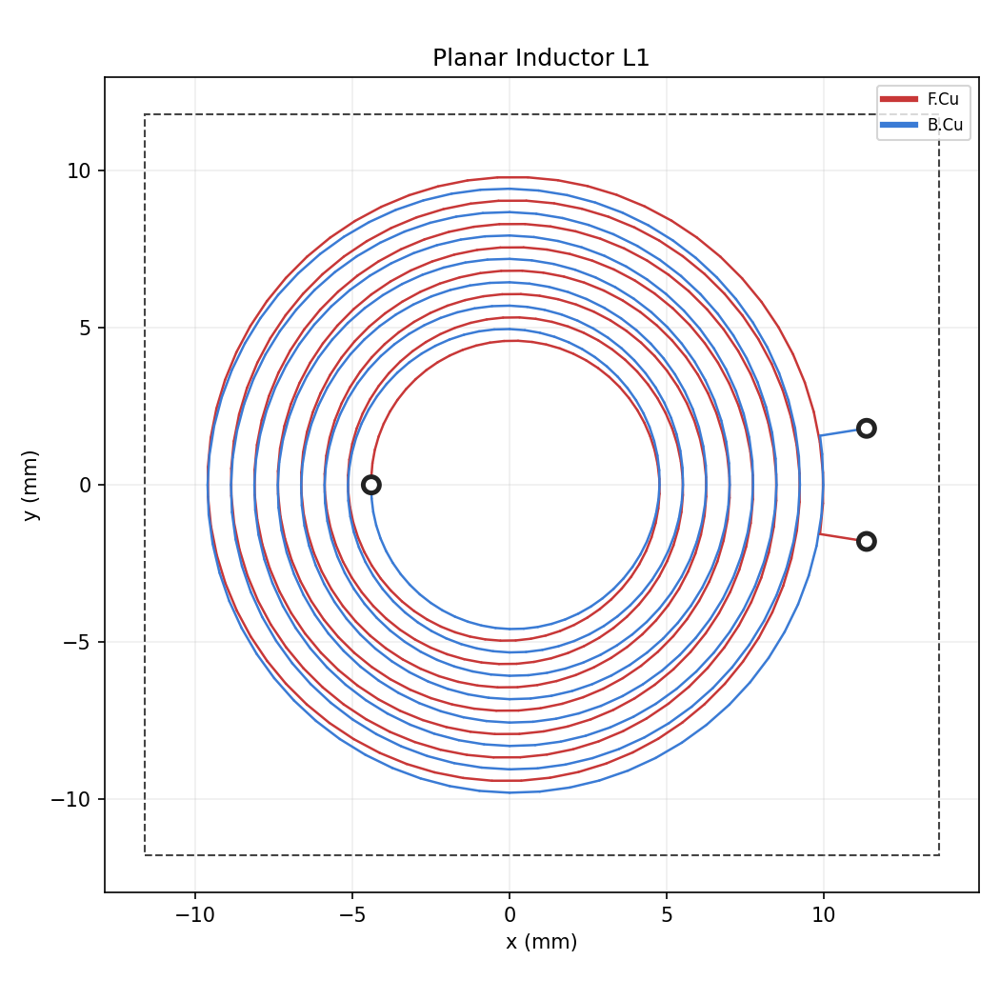

# planarmag — KiCad Planar Magnetics Generator

Generate **planar magnetics** — spiral inductors and planar transformers whose
windings are PCB copper — as ready-to-open KiCad boards.

The board file (`.kicad_pcb`, KiCad 9/10 format) is written **directly as
s-expressions**, so you don't need KiCad or `pcbnew` installed to *generate*
boards — only to open them. Output is validated against KiCad 10's `kicad-cli`
(renders + DRC, 0 unconnected nets).



## What it does

- **Spiral windings** in any shape: circular (`--sides 64`), octagon (`8`),
  square (`4`), or **racetrack / rounded-rectangle** that hugs a rectangular
  core centre leg.
- **Enter your core** (`Core`) — one or **many legs**, each at its own `(x, y)`,
  round or rectangular. The winding hugs the wound leg and fits the window; every
  leg gets a board cut-out. Pick a real **library core** (`get_core("E32/6/20")`)
  or define your own.
- **Wire-wound → planar converter** — give a wound transformer (turns ratio +
  wire AWG/copper) and get ranked planar options, trading **core size** against
  **parallel windings / layers**.
- **Core + material data library** — real Ferroxcube / IEC-62317 planar-E
  dimensions (legs, window, Ae/le/Ve) and a ferrite material table (µi, B_sat).
- **Physics** — magnetizing inductance (with **air gap**), **leakage** inductance
  (reflects interleaving), and a saturation check, from the core material.
- **Layer sizing** — pick layers-per-PCB and a target (turns or inductance); it
  computes the turns/layer, layers, and number of stacked boards needed.
- **Topology selection** — flyback, forward (+ 2-switch / active-clamp),
  half-/full-bridge, push-pull, LLC half-/full-bridge: get the turns ratio,
  duty, primary swing, peak flux, RMS currents and gap requirement per topology.
- **Per-winding trace width & clearance** — set them globally, or independently
  for the primary and secondary.
- **Split across many PCBs** — break a winding over several stacked 2-/4-layer
  boards joined by vertical pin columns, instead of one expensive many-layer
  board. One `.kicad_pcb` per board.
- **Multi-layer, series-stacked coils** — each copper layer adds turns; layers
  are via-joined and wound the same way so their flux adds. Vias/terminals are
  collision-free for any layer count.
- **First-order estimates** — inductance (Mohan current-sheet), DC resistance,
  conductor length, turns ratio.
- **PNG/SVG previews** for quick visual checks (needs matplotlib).

## Install

```bash
cd "PlanarMagnetics"
pip install -e .            # gives you the `planarmag` command
# or run in-place with PYTHONPATH=. (examples/tests handle this themselves)
```

Python ≥ 3.10. `matplotlib` is optional (previews / `pip install -e .[preview]`).

## Trace width & clearance

Every builder takes the conductor rules directly. For transformers each winding
is independent:

```python
make_transformer(primary_turns=6, secondary_turns=3,
                 primary_width=0.5, primary_clearance=0.3,    # heavier primary
                 secondary_width=0.3, secondary_clearance=0.25)
```

CLI: `--width` / `--clearance` (global) and `--pri-width --pri-clearance
--sec-width --sec-clearance` (per winding).

## Cores: library, custom, and multi-leg

The library holds real planar-E cores (Ferroxcube / IEC-62317 dimensions, with
Ae/le/Ve). List them with `planarmag cores`; use one by name or `ELP` alias:

```python
from planarmag import get_core, make_transformer
core = get_core("E32/6/20")           # or get_core("ELP32"), get_core("E32")
board, _ = make_transformer(primary_turns=8, secondary_turns=4, core=core)
```

The centre leg of a planar-E core is a long rectangular bar, so the winding is a
racetrack that hugs it (the leg's end-turns extend past the core depth, as in
real planar transformers — the board edge is sized to the copper and the core
outline is drawn on `Cmts.User` for reference).

Define your own single-leg core, or a **multi-leg** core with arbitrary leg
positions (each gets a board cut-out):

```python
from planarmag import Core, Leg, make_inductor

core = Core("custom", legs=[
    Leg(shape="rect", width=6, length=14, wound=True,  cutout=True),   # centre
    Leg(shape="round", pos=(16, 0), diameter=5, cutout=True),          # outer
    Leg(shape="round", pos=(-16, 0), diameter=5, cutout=True),
], window_radial=6.0)
board, _ = make_inductor(turns=5, core=core)
```

CLI for a single custom leg: `--leg-rect W L --window WIN` or
`--leg-round DIA --window WIN` (plus `--core-clearance`, `--footprint W L`).

## Wire-wound → planar conversion

Convert an existing wound design to planar and see the core-size vs.
parallel-copper trade-off, ranked by fewest layers:

```python
from planarmag import WireWound, Winding, convert_report
spec = WireWound(primary=Winding(turns=12, awg=24),
                 secondary=Winding(turns=3, awg=18))
print(convert_report(spec, copper_oz=(1.0, 2.0)))
```

```
core E58/11/38: 4 layers total -> 1 x 4-layer board(s)   (2 oz)
  primary    12T  2series x 1parallel =  2 layers  w=3.16mm ...
  secondary   3T  1series x 2parallel =  2 layers  w=6.52mm ...
core E43/10/28: 7 layers total -> 2 x 4-layer board(s)   ...
```

CLI: `planarmag convert --pri-turns 12 --sec-turns 3 --pri-awg 24 --sec-awg 18`.
Give copper as `--pri-awg`/`--strands` or `--pri-area MM2`; bigger cores need
less paralleling.

## Topology selection

Pick the converter topology and a spec, and the transformer design follows
(ratio, duty, the primary voltage that drives the flux, RMS currents, gap):

```python
from planarmag import ConverterSpec, compare_topologies, operating_point
spec = ConverterSpec(vin=400, vout=24, power=220, freq=150e3, vin_min=380)
print(compare_topologies(spec, ns_turns=4, ae_mm2=130))   # table over all topologies
op = operating_point(spec, "LLC half-bridge", np_turns=27, ns_turns=4, ae_mm2=130)
print(op.report())
```

Supported: `flyback`, `forward`, `two-switch forward`, `active-clamp forward`,
`half-bridge`, `full-bridge`, `push-pull`, `LLC half-bridge`, `LLC full-bridge`
(aliases `llc`, `fb`, `hb`, …). Flyback is flagged as energy-storage (needs a
gap); bridges/LLC run bipolar at low flux; forward runs unipolar (watch B).

CLI: `planarmag topology --vin 400 --vout 24 --power 220 --freq 150 --core E32/6/20`
(add `--topology llc` for one). The worked example
[`examples/demo_plt32_llc.py`](examples/demo_plt32_llc.py) selects a topology and
builds the matching 7-layer PLT32 board.

## Physics: inductance, air gap, saturation, leakage

Give a `material` (and optional `air_gap_mm`, current) to get real numbers
instead of the air-core estimate:

```python
from planarmag import make_transformer, get_core
board, summary = make_transformer(primary_turns=8, secondary_turns=4,
                                  core=get_core("E32/6/20"), material="3F3",
                                  air_gap_mm=0.2, peak_current_a=2.0)
print(summary)
#   L (magnetizing) : 189.49 uH  (16 turns)
#   saturation      : B_peak 182 mT vs Bsat 370 mT @ 100C (x2.03 margin, OK)
#   leakage (pri)   : 482 nH (est., interleaved)
```

* Magnetizing `L = N² · AL`, with `1/µe = 1/µi + lg/le` for the gap (gapped
  values are accurate; ungapped carry the datasheet's ±25% AL spread).
* Leakage via the 1-D MMF-energy method over the physical layer stack — so
  interleaving (P,S,P,S) really does show lower leakage than stacked (P,P,S,S).
* Saturation `B = L·I/(N·Ae)` (or `V·t/(N·Ae)`) vs the material's `B_sat`.

`planarmag materials` lists the ferrites. The physics flags also work on the
`inductor`/`transformer` CLI commands (`--material 3F3 --air-gap 0.2 ...`).

## Sizing: how many layers / boards

Pick the layers per PCB and a target; it tells you the turns/layer, layers and
number of boards:

```python
from planarmag import plan_for_inductance, get_core
plan = plan_for_inductance(250e-6, core=get_core("E32/6/20"), material="3F3",
                           air_gap_mm=0.2, layers_per_board=4, turns_per_layer=6)
print(plan.line())
#   38 turns -> 6/layer x 7 series = 7 layers -> 2 x 4-layer board(s)
```

CLI: `planarmag size --target-uh 250 --core E32/6/20 --material 3F3
--air-gap 0.2 --layers-per-board 4`.

## Splitting across stacked boards

```python
from planarmag import make_inductor_stack, Pin

stack = make_inductor_stack(turns_per_layer=6, layers_per_board=2, num_boards=4,
                            outer_diameter=24, pin=Pin(drill=0.7, pad=1.4))
stack.save_all("out")          # -> board1of4.kicad_pcb ... board4of4.kicad_pcb
print(stack)
```

Each board carries `layers_per_board` copper layers (must be even). Boards
connect in series through `num_boards + 1` vertical pin columns at identical
`(x, y)` on every board: a header pin at each column joins one board's OUT to the
next board's IN. Columns `C0` and `Cn` are the external terminals; on boards that
don't use a given column the pin passes through a clearance hole.

`make_transformer_stack(...)` does the same for a transformer, with separate pin
columns for primary and secondary.

CLI: add `--boards N` (then `-o` is treated as an output **folder**):

```bash
python -m planarmag inductor --turns 6 --layers 2 --boards 4 -o out/Lstack
```

## Python API

```python
from planarmag import make_inductor
from planarmag.preview import render_png

board, summary = make_inductor(turns=8, outer_diameter=20, copper_layers=2)
board.save("inductor.kicad_pcb")
render_png(board, "inductor.png")
print(summary)
```

Drop down to the `Coil` primitive for full control — it threads one winding
through an explicit list of copper layers, on any `Shape`:

```python
from planarmag.kicad import Board
from planarmag.shapes import RoundedRect
from planarmag.windings import Coil

board = Board(copper_layers=4)
net = board.add_net("L")
Coil(turns=5, trace_width=0.4, clearance=0.3, layer_indices=[0, 1, 2, 3],
     net=net, shape=RoundedRect(10, 7, 2)).build(board)
board.save("custom.kicad_pcb")
```

## Layout

| File | Purpose |
|------|---------|
| `planarmag/geometry.py`  | spiral point generation (`shape_spiral`, `polygon_spiral`) |
| `planarmag/shapes.py`    | `Circle` / `RoundedRect` contours (`point_at`, `grown`) |
| `planarmag/core.py`      | `Core` / `Leg` multi-leg model, cut-outs, window sizing |
| `planarmag/core_data.py` | the core database (real planar-E dimensions, cited) |
| `planarmag/materials.py` | ferrite material database (µi, B_sat, cited) |
| `planarmag/physics.py`   | magnetizing/leakage inductance, gap, saturation |
| `planarmag/topology.py`  | converter topology design equations + comparison |
| `planarmag/sizing.py`    | turns/layers/boards for a target |
| `planarmag/convert.py`   | wire-wound → planar conversion (AWG table, ranking) |
| `planarmag/kicad.py`     | `.kicad_pcb` writer (segments, vias, cut-outs, text) |
| `planarmag/windings.py`  | `Coil`: multi-layer winding, via stitching, fixed terminals |
| `planarmag/devices.py`   | `make_inductor/transformer` + `_stack` variants + estimates |
| `planarmag/preview.py`   | matplotlib PNG/SVG preview |
| `planarmag/cli.py`       | `python -m planarmag …` |
| `examples/`, `tests/`    | runnable examples; `python tests/test_planarmag.py` |

## Caveats / accuracy

- Electrical values are **first-order estimates** (the Mohan current-sheet model
  assumes a single air-core planar spiral; multi-layer uses ideal unity-coupling
  `N²` scaling). Ballpark only — verify real designs with a field solver (FEMM,
  openEMS, Ansys).
- No magnetic-core reluctance/saturation, thermal, or AC-resistance
  (skin/proximity) modelling. Library core dimensions are nominal — verify.
- `kicad-cli` DRC on the generated boards reports **0 unconnected**; remaining
  items are cosmetic (silkscreen text near the edge) or the intentional terminal
  connection vias.
- Spirals are polygonal approximations (raise `--sides` for smooth curves); true
  KiCad track arcs are not emitted. Terminals end in a connection via, not a
  connector footprint.

## License

MIT
